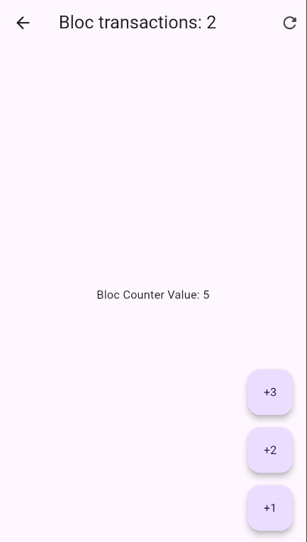
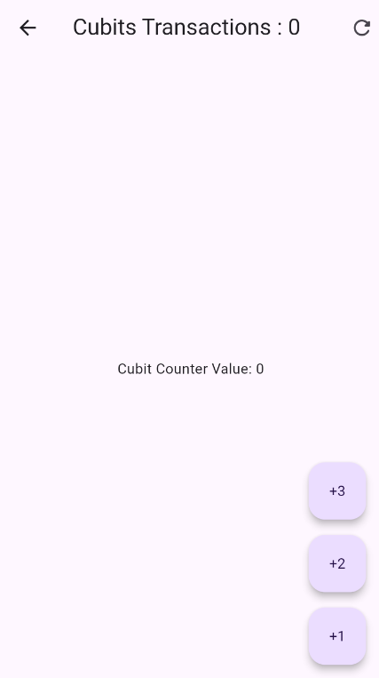
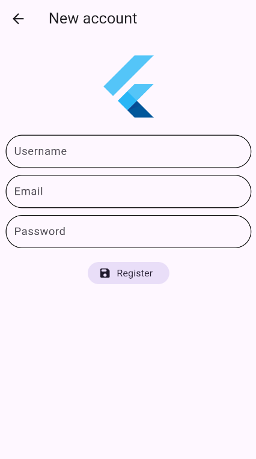

# Flutter Menu App with Bloc, Cubits, and zForm

This Flutter application demonstrates the use of Bloc, Cubits, and the `zForm` library for form validation within a single app with a simple menu.

## Features

- **Counter with Bloc**: Implements a basic counter using the `flutter_bloc` library for state management.
- **Counter with Cubits**: Implements another basic counter using the `flutter_bloc` library's `Cubit` for state management.
- **Form with Cubits and zForm**: Features a simple form built with Cubits and utilizes the `zForm` library for input validation.
- **Clean Navigation**: Uses `go_router` for straightforward navigation between the different sections of the app.

## Screenshots

*(Include screenshots here showcasing the menu, the Bloc counter, the Cubit counter, and the form. Replace `screenshots/menu.png`, `screenshots/bloc_counter.png`, `screenshots/cubit_counter.png`, and `screenshots/form.png` with actual paths to your screenshots.)*






## Requirements

- Flutter SDK (version 3.0.0 or higher)
- Dart (version 2.17.0 or higher)

## Installation

1. **Clone the repository**:
   ```bash
   git clone <YOUR_REPOSITORY_URL>
   ```

2. **Navigate to the project directory**:
   ```bash
   cd forms_app_cubits_bloc
   ```

3. **Install dependencies**:
   ```bash
   flutter pub get
   ```

4. **Run the app**:
   ```bash
   flutter run  
   ```

## Usage

1. Open the app on your device or emulator.
2. You will see a menu with three options: "Bloc", "Cubits", and "New account".
3. Cubits: Tap on this option to navigate to a screen with a counter managed by a Cubit.
4. Bloc: Tap on this option to navigate to a screen where you can increment and decrement a counter managed by a Bloc.
5. New account: Tap on this option to see a simple form with at least one input field that uses zForm for validation. Try submitting the form with and without valid input to see the validation in action.

## Proyect Structure

```
your_project_name/
├── lib/
│ ├── main.dart           # Entry point of the application
│ ├── config/
│ │ └── router/
│ │   └── app_router.dart # Configuration for go_router
│ ├── theme/
│ │ └── app_theme.dart    # Application theme
│ ├── infrastructure/
│ │ └── inputs/           # Custom input classes using formz
│ │   ├── email.dart
│ │   ├── inputs.dart     
│ │   ├── password.dart
│ │   └── username.dart
│ ├── presentation/
│ │ ├── bloc/
│ │ │ ├── counter_bloc/
│ │ │ │ ├── counter_bloc.dart
│ │ │ │ ├── counter_event.dart
│ │ │ │ └── counter_state.dart
│ │ │ ├── counter_cubit/
│ │ │ │ └── counter_cubit.dart
│ │ │ └── register_cubit/
│ │ │   ├── register_cubit.dart
│ │ │   ├── register_state.dart
│ │ │   └── register_event.dart 
│ │ ├── screens/
│ │ │ ├── bloc_counter_screen.dart
│ │ │ ├── cubit_counter_screen.dart
│ │ │ ├── home_screen.dart      # The main menu screen
│ │ │ ├── register_screen.dart  # The form example screen
│ │ │ └── screens.dart        
│ │ └── widgets/
│ │   └── inputs/           # Custom input widgets
│ │     └── widgets.dart    
├── test/
└── pubspec.yaml        # Project dependencies
```

## Dependencies

These are the dependencies used in this project:

`equatable`: Helps in comparing objects for equality, especially useful in Bloc and Cubit states and events.
`flutter`: The core Flutter SDK.
`flutter_bloc`: Provides the necessary tools for implementing the Bloc and Cubit patterns for state management.
`formz`: A utility library for handling form state and validation, often used in conjunction with Bloc or Cubit.
`go_router`: A declarative, router package for Flutter that simplifies navigation.

## Contributing
Contributions are welcome! If you have any suggestions or find any issues, please feel free to open an issue 1  or submit a pull request.